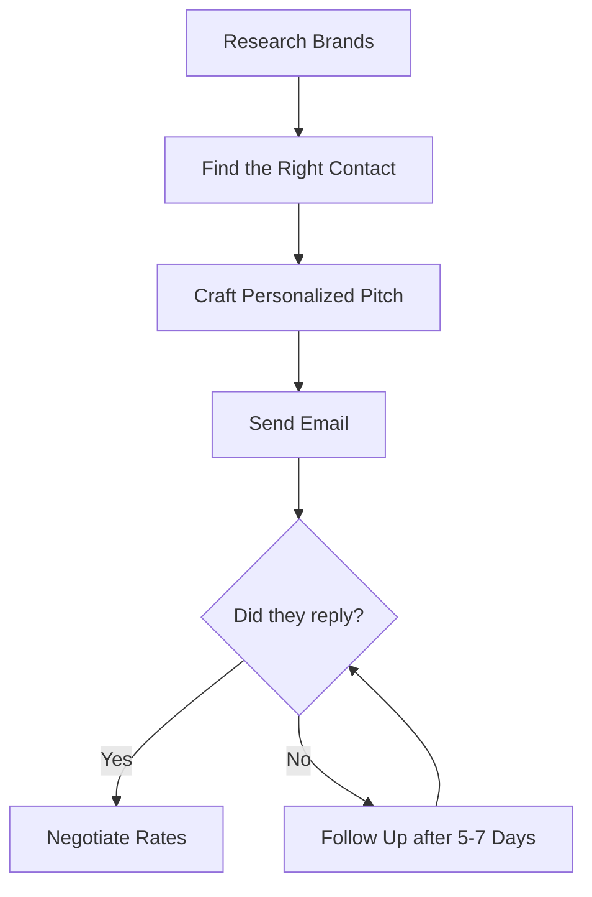

Entering the world of digital content creation is an exciting journey. In the early stages, you focus on finding your voice, designing graphics, editing videos, and building a community. But as your audience grows, a common question arises: *How do I turn this passion into a sustainable career?*

For most creators, the answer lies in **brand collaborations**. 

A brand collaboration (often called a brand partnership or sponsorship) is a business arrangement where a creator produces content that promotes a brand's product or service in exchange for compensation. This compensation can range from free products (gifted campaigns) to flat paid rates, CPM fees, or affiliate commissions.

Many creators assume they need hundreds of thousands of followers to land sponsorships. However, brands are shifting budgets toward **micro-creators** (10,000 to 50,000 followers) and **nano-creators** (under 10,000 followers) because smaller audiences often have higher engagement and trust.

In this guide, we will break down everything you need to know about landing, negotiating, and executing successful brand collaborations in simple, accessible language.

---

## 1. Types of Brand Collaborations

Before reaching out to brands, you must understand the common partnership structures:

### Gifted Collaboration (Product Exchange)
* **What it is:** The brand sends you a free product in exchange for content coverage (e.g., a review, unboxing, or styling post).
* **When to use:** Best for beginners looking to build a portfolio of brand work. 
* **Warning:** In many countries, you must disclose gifted items for tax purposes. Be careful not to accept massive workloads for low-value products.

### Paid Sponsorship (Flat Fee)
* **What it is:** The brand pays you a fixed fee to produce specific deliverables (e.g., one Instagram Reel, a YouTube integration, or a dedicated blog post).
* **When to use:** The standard goal for monetizing creators. You establish rates based on audience size, engagement, and content creation complexity.

### Affiliate Partnerships
* **What it is:** The brand provides a custom tracking link or discount code. You earn a percentage commission on every sale made through your link.
* **When to use:** Great for product recommendations you naturally use and love. Affiliate links can run alongside paid sponsorships to generate passive income.

### Long-Term Brand Ambassadorships
* **What it is:** A multi-month or annual contract where you act as an official face of the brand, posting a set number of updates per month.
* **When to use:** The gold standard of partnerships. Ambassadorships provide reliable income and build deeper trust with your audience.

---

## 2. Prerequisites: What You Need Before You Pitch

You wouldn't apply for a job without a resume. Similarly, you shouldn't pitch to a brand without knowing your metrics. Brands evaluate creators based on three primary factors:

### Niche Clarity
What is your channel about? Brands want to partner with creators whose content aligns with their target market. A fitness brand will sponsor a health coach, not a gaming channel. Define your niche clearly (e.g., vegan cooking, budget travel, or tech reviews).

### Engagement Rate (ER)
Follower counts can be bought or inflated, which is why brands focus on **engagement rate**. This metric measures the percentage of your followers who actively interact (like, comment, save, and share) with your content. 
* A healthy engagement rate is between **3% and 6%**.
* Before pitching, calculate your exact metrics using our free [Instagram Engagement Calculator](file:///c:/Users/rrajb/Downloads/creatorsfeel.com/src/pages/tools/instagram-engagement-calculator.astro) to audit your profile health.

### Audience Demographics
Brands need to know *who* they are reaching. You must provide breakdowns of your audience's:
* Age ranges.
* Gender distribution.
* Top geographic locations (countries/cities).

You can find this data inside the built-in analytics dashboards of Instagram, YouTube, TikTok, or your website's analytics panel.

---

## 3. Creating a High-Converting Media Kit

A **media kit** is a digital document that acts as your creator resume. It should be clean, professional, and easy to read. Typically saved as a PDF or hosted online, a standard media kit includes:

1. **Short Biography:** A brief description of who you are, what your niche is, and the mission behind your content.
2. **Profile Statistics:** Follower counts, monthly views, and average engagement rates across all social media channels.
3. **Audience Insights:** Graphs showing top country locations and age demographics.
4. **Visual Content Examples:** High-quality screenshots of your best work.
5. **Services Offered:** A list of what you can produce (e.g., Reels, TikToks, YouTube dedicated videos, product photography, newsletter features).
6. **Contact Information:** A professional email address (avoid generic addresses like `yourname12345@gmail.com` if possible; use a custom domain name).

---

## 4. How to Pitch to Brands: Step-by-Step

Pitching is the act of reaching out to a brand to propose a collaboration. It requires research, personalization, and follow-through.

### Step 1: Research Brands
Start by listing brands you already use and love. Look at what brands sponsor other creators in your niche. Keep a spreadsheet tracking the brand name, website, and social handles.

### Step 2: Find the Right Contact Person
Never send pitches to a brand's customer support email (like `info@brand.com`) or DM their social media handles if you can avoid it. These channels are handled by customer service agents who rarely forward emails to marketing teams.
* Search for emails specifically containing words like **PR**, **Influencer Relations**, **Partnerships**, or **Marketing**.
* Use LinkedIn to search for roles like "Influencer Marketing Manager [Brand Name]" or "PR Coordinator [Brand Name]" to locate names.

### Step 3: Craft a Personalized Pitch Email
A great pitch is short, professional, and focuses on **what the brand gains** from partnering with you, rather than what you want from them.

Here is a standard structure for a pitch email:
* **Subject Line:** Make it clear and relevant (e.g., *Collaboration Inquiry: [Your Social Handle] x [Brand Name]*).
* **The Hook:** Mention a specific product of theirs you love or reference a recent campaign they ran.
* **The Introduction:** State who you are, your niche, and your follower counts.
* **The Value Proposition:** Explain why your audience is a perfect fit for their products.
* **The Proposal:** Suggest a specific content idea (e.g., *I would love to showcase your new sunscreen in a Summer Skincare Routine Reel*).
* **Call to Action:** Attach your media kit and invite them to discuss pricing.

If you need help pricing your services and drafting a professional pitch template tailored to your specific audience size, use our [Influencer Rate Calculator](file:///c:/Users/rrajb/Downloads/creatorsfeel.com/src/pages/tools/influencer-rate-calculator.astro) to generate rate estimates and pitch templates.

### Step 4: The Follow-Up
Marketing managers receive dozens of pitches daily. If you do not hear back within **5 to 7 business days**, send a polite, short follow-up email on the same thread. Many partnerships are closed on the second or third email contact.

---

## 5. Pricing and Negotiating Your Rates

Determining how much to charge is one of the hardest parts of being a creator. While there is no single rule, several metrics guide baseline pricing:

### The Industry Standard Guideline
The baseline rate for social media sponsorships has historically hover around **$10 per 1,000 followers** (a $10 CPM). 
* **10,000 followers:** ~$100 per post.
* **50,000 followers:** ~$500 per post.
* **100,000 followers:** ~$1,000 per post.

However, this rate is highly flexible. You can charge significantly more if:
* You have an exceptionally high engagement rate (above 5%).
* Your niche is highly specialized (like business software, finance, or medicine).
* The format requires complex production (like a dedicated YouTube video vs. a simple Instagram Story).

### How to Calculate Your Campaign Value
To evaluate campaigns using CPM bidding structures, learn how to calculate cost per thousand impressions using our [CPM Calculator](file:///c:/Users/rrajb/Downloads/creatorsfeel.com/src/pages/tools/cpm-calculator.astro).

### Negotiation Tips
* **Never accept the first offer immediately:** Brands often leave buffer room in their initial budgets. Polite counter-offers can increase your payouts.
* **Bundle deliverables:** Offer packages to increase deal size (e.g., *Instead of one Reel for $300, I can produce two Reels and three Stories for $500*).
* **Charge for usage rights:** If a brand wants to use your video as a paid ad on Facebook or TikTok, they must pay for licensing/usage rights. A standard fee is an additional 20% to 50% of the base rate per month of ad usage.

---

## 6. Contracts and Sponsorship Legal Guidelines

Once you agree on deliverables and pricing, **never start producing content without a signed contract.** A contract protects both you and the brand. Look for these key clauses:

### Exclusivity
Exclusivity clauses prevent you from promoting competitors for a set period. For example, if you partner with a skincare brand, they may ask that you don't promote any other skincare brands for 30 days. Ensure the exclusivity period is short, or charge a premium fee for long exclusivity terms.

### Deliverables and Timeline
The contract must list exactly what you are producing, where it will be posted, and the exact deadlines for drafts and publishing dates.

### Payment Terms
Ensure the contract states *how* and *when* you will be paid. Standard business payment terms are **Net 30** or **Net 60** (meaning you receive payment 30 or 60 days after submitting your final invoice).

### FTC Disclosures (Legal Requirement)
In the United States, the Federal Trade Commission (FTC) requires that paid relationships be disclosed clearly. Similar rules exist globally.
* You must place disclosures (like **#ad**, **#sponsored**, or **#paidpartnership**) where users can easily see them.
* Do not hide disclosures in a sea of hashtags or below the "more" button in captions.
* On video content, display the disclosure on screen or mention it verbally.

---

## 7. Delivering Exceptional Results to Brands

To build a sustainable creator business, you want repeat partners. The easiest way to get sponsored again is to prove your value:

* **Communicate Professionally:** Reply to emails within 24 hours. Be polite, accept constructive feedback during draft reviews, and meet your deadlines.
* **Focus on Quality:** Ensure your audio is clear, lighting is bright, and the product is shown clearly. Follow the brand's creative brief instructions.
* **Send a Post-Campaign Report:** 5 to 7 days after your content goes live, take screenshots of your analytics (reach, impressions, likes, comments, link clicks) and send a short report to the brand manager. Thank them for the opportunity and suggest a follow-up campaign idea.

---

## Conclusion

Securing brand collaborations is a rewarding milestone for digital creators. It validates your hard work and provides the financial resources needed to improve your content production.

Remember: you do not need millions of followers. By clarifying your niche, auditing your engagement, designing a clean media kit, and pitching professionally, you can build profitable partnerships.

Take your first step today:
1. Audit your profile health with our [Instagram Engagement Calculator](file:///c:/Users/rrajb/Downloads/creatorsfeel.com/src/pages/tools/instagram-engagement-calculator.astro).
2. Calculate your rates and generate a customized pitch using our [Influencer Rate Calculator](file:///c:/Users/rrajb/Downloads/creatorsfeel.com/src/pages/tools/influencer-rate-calculator.astro).
3. Draft your list of target brands and send your first pitch!
